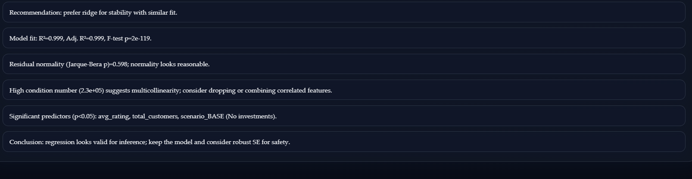

# Simulation-Based Revenue Optimization  
Event-Driven Simulation with Statistical Modeling and Diagnostic Analytics

---

## Motivation

This project was built to integrate multiple domains of expertise into a unified analytical system.

It combines:

- Event-driven simulation (Monte Carlo methodology)
- Linear regression and econometric diagnostics
- Statistical inference and model validation
- Python-based data pipelines
- JavaScript and HTML for interactive web interfaces

The objective was to design a full analytical workflow: simulate operational scenarios, generate structured datasets, model revenue drivers statistically, and present insights through a clean, interactive interface.

Rather than treating simulation and regression as separate academic exercises, this project connects them into a single decision-support tool.

---

## Overview

This system implements an event-driven simulation engine for modeling operational performance across multiple business scenarios and applies advanced regression diagnostics to analyze revenue drivers.

The platform integrates simulation, statistical modeling, inference validation, regularization techniques, and visualization into a cohesive analytical pipeline.

The project demonstrates applied knowledge in:

- Operations Research  
- Statistical Modeling  
- Econometrics  
- Monte Carlo Simulation  
- Machine Learning Stabilization  
- Data Engineering and Visualization  

---

## System Architecture

Simulation Engine → Dataset Generator → Regression Pipeline → Diagnostics → Visualization → Web Dashboard

### Core Components

| Module | Responsibility |
|--------|---------------|
| SeaWorldSimulation.py | Event-driven simulation engine |
| simulate.py | Multi-run dataset generation |
| analyze.py | OLS modeling and statistical diagnostics |
| webapp.py | Interactive dashboard |
| SeaWorldLinearRegression.py | Legacy regression workflow |
| requirements.txt | Dependency management |

---

## Simulation Engine

The system models multiple operational alternatives:

- BASE  
- ALT1–ALT10  

Each simulation run generates:

- avg_rating  
- avg_food_income  
- total_customers  
- total_revenue  
- additional operational metrics  

Key features:

- Configurable random seed control  
- Multiple replications per scenario  
- Scenario-level investment modeling  
- Automated ROI comparison  
- Monte Carlo variability analysis  

---

## Regression Base Model

Primary specification:

Total Revenue = β₀ + β₁(avg_rating) + β₂(avg_food_income) + β₃(total_customers)

Implemented using `statsmodels` OLS.

The model can optionally incorporate:

- Robust standard errors (HC3)
- Ridge regularization
- Box–Cox transformation checks
- Automatic ridge parameter selection (cross-validation)

---

## Statistical Diagnostics Included

### Model Fit
- R-squared  
- Adjusted R-squared  
- F-statistic  
- AIC / BIC  

### Inference
- t-tests  
- p-values  
- Confidence intervals  
- Robust covariance estimation  

### Residual Analysis
- Residuals vs Fitted  
- Q-Q Plot  
- Jarque–Bera normality test  

### Heteroskedasticity
- Breusch–Pagan test  

### Multicollinearity
- Condition number  
- Ridge stabilization  
- Cross-validated ridge alpha  

### Influence Diagnostics
- Cook’s Distance  
- Leverage analysis  

---

## Scenario ROI Analysis

The system computes:

- Mean revenue per scenario  
- Investment-adjusted comparisons  
- Revenue ranking across alternatives  
- Scenario-level performance diagnostics  

This enables structured comparison of operational strategies under uncertainty.

---

# Main Interface

## Interface Preview

### 1. Home Screen

The dashboard centralizes simulation execution and regression configuration.  
Users can select scenarios, define replication counts, configure modeling options, and trigger analysis in a single environment.

---

### 2. Simulation & Modeling Controls

Operational parameters and econometric specifications are clearly separated.  
This enforces a disciplined workflow:

Simulation → Data Generation → Model Specification → Diagnostic Evaluation

---

### 3. Simulation Execution State

During Monte Carlo execution, the system provides:

- Scenario tracking  
- Replication progress  
- Estimated time remaining  
- Execution transparency  

---

### 4. Scenario Revenue Overview

Aggregated scenario-level comparison supporting structured ROI analysis and strategic evaluation.

---

### 5. Regression Summary Output

Comprehensive OLS output including coefficient estimates, statistical significance, and global model diagnostics.

---

### 6. Extended Diagnostics

Highlights multicollinearity indicators and model stability considerations.

---

### 7. Residual Diagnostics

Validates linearity assumptions and homoscedastic error behavior.

---

### 8. Q-Q Normality Assessment

Evaluates residual distribution consistency with normality assumptions.

---

### 9. Diagnostic Dashboard

Consolidates multiple diagnostic views:

- Residual structure  
- Prediction accuracy  
- Influence and leverage analysis  

---

### 10. Automated Analytical Commentary

The system generates structured analytical interpretations, including:

- Normality checks  
- Heteroskedasticity testing  
- Multicollinearity warnings  
- Ridge recommendations  
- Model validity summary  

---

### 11. Extended Insight Summary

Provides final recommendations based on statistical evidence and stability considerations.

---

## Analytical Note

From a modeling perspective, scenario alternatives ideally should be encoded as categorical variables when predicting future experiments or unseen configurations.  

In its current implementation, this system is primarily structured as a comparative decision-support tool across predefined alternatives.  

It excels at:

- Evaluating operational strategies  
- Comparing investment scenarios  
- Diagnosing model validity  
- Interpreting statistical robustness  

While not a full predictive production model, it provides a rigorous framework for structured alternative analysis under uncertainty.

---
# Personal Note

This project represents an attempt to bridge theoretical knowledge and practical implementation.

It integrates simulation theory, statistical inference, and web-based interaction into a unified analytical tool.

The goal was not only to build a functioning system, but to demonstrate disciplined modeling, diagnostic awareness, and thoughtful interpretation of results.

---

