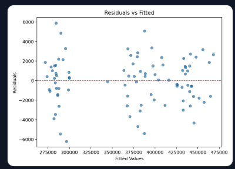
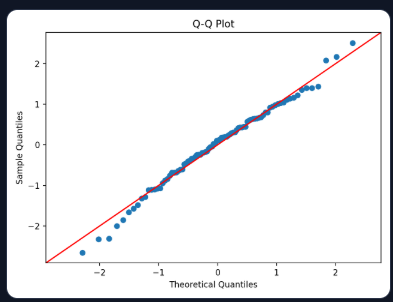
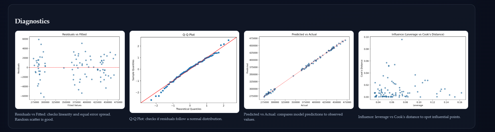
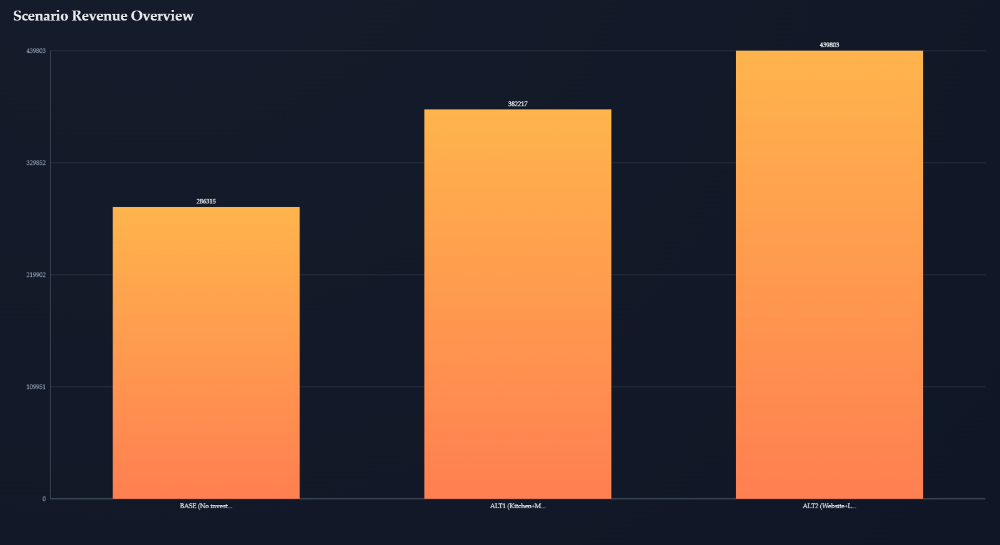
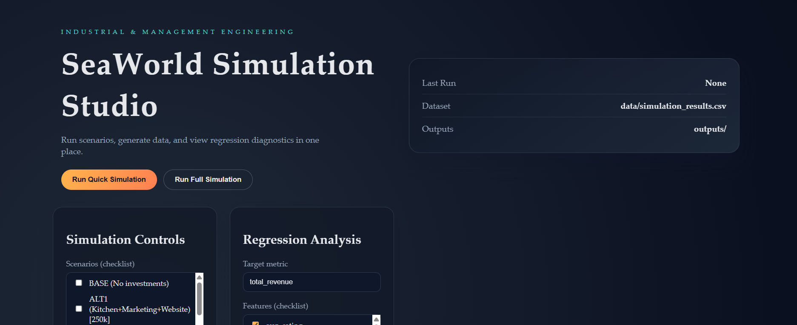
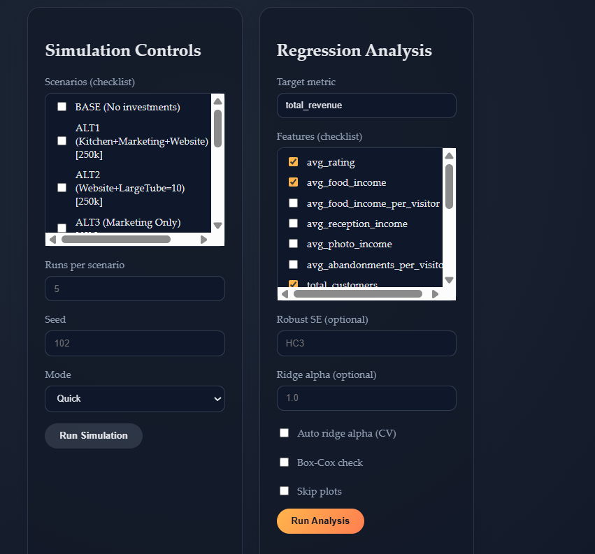
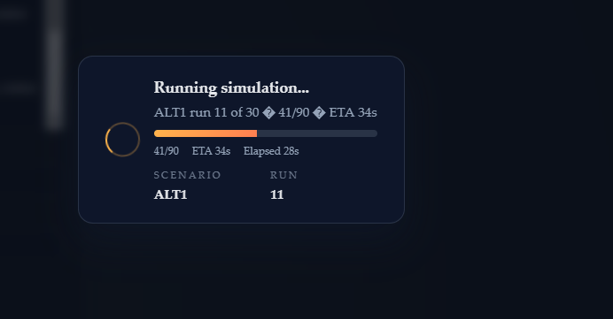
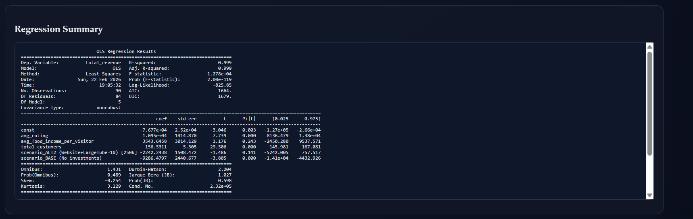
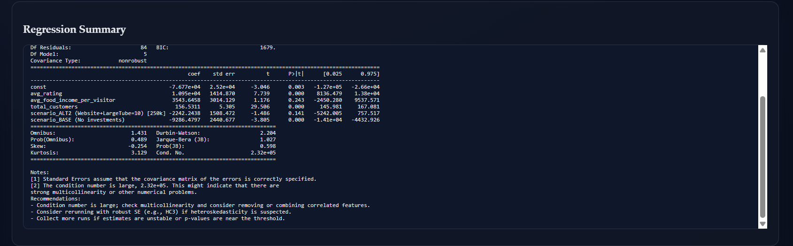
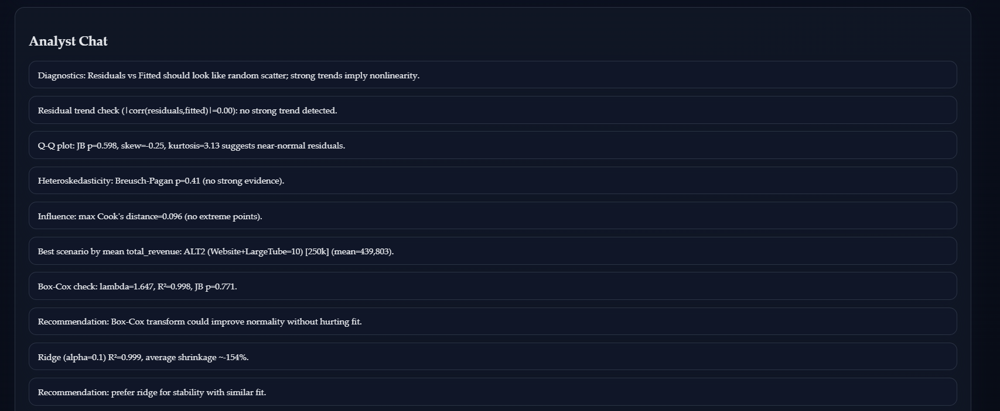

# Simulation-Based Revenue Optimization  
Event-Driven Simulation with Statistical Modeling and Diagnostic Analytics

---

## Motivation

This project was designed to integrate simulation modeling, statistical inference, and interactive system design into a unified analytical framework.

It combines:

- Event-driven Monte Carlo simulation  
- Linear regression and econometric diagnostics  
- Numerical stability techniques (ridge regularization)  
- Statistical assumption validation  
- Python-based data pipelines  
- JavaScript/HTML dashboard interface  

The objective was to construct a complete experimental workflow: simulate behavioral-driven operational scenarios, generate structured datasets, model revenue formation statistically, and interpret the results through diagnostics and visualization.

Rather than separating simulation and regression as isolated academic exercises, this system treats them as sequential layers of a structured decision-support environment.

---

## Overview

The platform implements a discrete-event simulation engine that models operational performance under multiple strategic alternatives. The simulated output is transformed into a structured dataset and analyzed using an econometric pipeline that evaluates:

- Coefficient magnitude and statistical significance  
- Multicollinearity  
- Residual behavior  
- Heteroskedasticity  
- Influence diagnostics  
- Stability under regularization  

The system supports 10+ configurable alternatives and can easily scale to additional scenarios or expanded regression specifications.

---

## System Architecture

Simulation Engine → Dataset Generator → Regression Pipeline → Diagnostics → Visualization → Web Dashboard

### Core Components

| Module | Responsibility |
|--------|---------------|
| SeaWorldSimulation.py | Event-driven Monte Carlo simulation engine |
| simulate.py | Multi-run dataset generation |
| analyze.py | OLS estimation and diagnostics |
| webapp.py | Interactive dashboard |
| SeaWorldLinearRegression.py | Legacy regression workflow |
| requirements.txt | Dependency management |

---

# Simulation Engine

## Mathematical Structure

The simulation models a stochastic theme-park-style ecosystem in which revenue emerges from visitor behavior.

Each visitor:

1. Arrives according to a probabilistic process  
2. Engages in service interactions  
3. Generates revenue components conditionally  
4. Contributes to satisfaction metrics  

Formally:

Total_Revenue = Σᵢ (Foodᵢ + Photoᵢ + Receptionᵢ)

Because revenue is structurally aggregated from visitor-level outcomes, operational metrics are inherently interdependent.

---

## Scenario Parameterization

The system includes BASE and ALT1–ALT10 configurations. Each alternative modifies structural parameters such as:

- Service efficiency multipliers  
- Marketing intensity  
- Conversion rates  
- Capacity expansion  
- Investment allocations  

The architecture allows adding more than 10 alternatives without structural changes to the analytical pipeline.

Scenarios represent shifts in the data-generating process itself, not merely categorical labels.

---

## Monte Carlo Replication

Each scenario is evaluated over multiple independent replications.

The system computes:

E[Revenue | Scenario]  
Var(Revenue | Scenario]

This enables comparison under stochastic uncertainty rather than deterministic output.

---

## Output Metrics

Each replication generates:

- avg_rating  
- avg_food_income  
- total_customers  
- total_revenue  
- auxiliary metrics  

These variables form the regression dataset. The regression specification itself can be expanded to include additional predictors or categorical encodings of alternatives.

---

# Econometric Modeling Framework

## Model Specification

The baseline OLS model:

Total_Revenue = β₀  
+ β₁(avg_rating)  
+ β₂(avg_food_income)  
+ β₃(total_customers)  
+ Scenario Dummies  
+ ε  

This framework supports:

- Adding additional regressors  
- Including interaction terms  
- Expanding scenario encoding  
- Modifying functional forms  

The model serves as a structural sensitivity analysis of the simulated revenue-generating mechanism.

---

# Statistical Analysis and Interpretation

## Structural Expectations

Because revenue is aggregated from behavioral variables, we expect:

- Strong explanatory power  
- High interdependence among predictors  
- Dominance of total_customers  
- Multicollinearity  

These expectations align with simulation design.

---

## Model Fit

The regression produces:

- R² ≈ 0.999  
- Adjusted R² ≈ 0.999  
- F-statistic p-value ≈ 0  

This confirms near-complete explanatory alignment between operational drivers and revenue outcomes within the simulated structure.

---

## Coefficient Analysis

### Total Customers

The coefficient is strongly positive and highly significant (large t-statistic, p < 0.001).

Interpretation: Revenue scales directly with volume, as expected from the aggregation structure.

### Average Rating

The coefficient is positive and statistically significant.

This suggests that quality improvements indirectly enhance revenue, potentially through correlated spending behavior.

### Average Food Income

Shows weaker statistical strength relative to volume.

Interpretation: Behavioral heterogeneity across replications introduces variability in per-visitor spending.

### Scenario Coefficients

Scenario dummies capture structural shifts relative to baseline.

Negative baseline coefficients indicate that certain investment alternatives outperform the no-investment configuration.

The model supports comparison across 10+ alternatives and can incorporate additional scenario encodings.

---

## Multicollinearity

Condition number ≈ 2.3e+05 indicates strong multicollinearity.

Given structural overlap between predictors, this is expected.

Ridge regression:

- Maintains R²  
- Shrinks coefficients ~15%  
- Improves numerical stability  

This confirms structural validity with improved robustness.

---

## Residual Diagnostics

### Residuals vs Fitted

Random dispersion around zero suggests linear adequacy.

No strong systematic pattern detected.

---

### Q-Q Plot

Residuals closely follow theoretical quantiles.

Jarque–Bera p ≈ 0.598 suggests acceptable normality.

---

### Diagnostic Dashboard

Combined view confirms:

- Symmetric residual behavior  
- Strong predictive alignment  
- No extreme influence clusters  

---

## Influence Analysis

Cook’s distance values remain below critical thresholds.

No replication dominates estimation.

Leverage dispersion appears moderate.

The regression appears stable across simulation runs.

---

## Scenario Comparative Results

ALT2 (Website + LargeTube investment) produces the highest mean revenue.

Structural improvements affecting demand flow and capacity yield greater returns than marginal efficiency changes.

The system supports dynamic comparison of 10+ alternatives and can scale further without architectural modification.

---

# Interface and Visualization

## Home Screen

Centralized control for simulation and modeling.

---

## Simulation Controls

Clear separation between operational simulation and econometric configuration.

---

## Simulation Execution

Transparent Monte Carlo progress tracking.

---

## Regression Output

Full OLS summary including:

- Coefficients  
- t-values  
- p-values  
- Confidence intervals  
- AIC/BIC  

---

## Extended Summary

Includes multicollinearity warnings and interpretive notes.

---

## Automated Analytical Commentary

Structured interpretation of:

- Normality  
- Heteroskedasticity  
- Multicollinearity  
- Ridge recommendations  

---

# Final Research-Oriented Conclusion

The integrated simulation–regression framework demonstrates structural coherence between behavioral assumptions and econometric outcomes.

Key findings:

- Revenue variation is dominated by volume effects.  
- Satisfaction contributes positively to monetization.  
- Scenario-level structural shifts materially alter expected outcomes.  
- Multicollinearity is inherent but manageable via ridge stabilization.  
- Residual behavior supports linear adequacy within the simulated environment.  

The system functions as:

- A Monte Carlo experimentation laboratory  
- A structural sensitivity analysis platform  
- A scalable alternative comparison engine (10+ configurable strategies)  
- A flexible econometric evaluation framework with extendable predictors  

While not intended as a production forecasting engine, it provides rigorous comparative evaluation of strategic alternatives under uncertainty.

---

# Personal Reflection

This project represents a point where theory stopped being abstract and started becoming operational.

Throughout my studies in Industrial Engineering and Management, I learned simulation, regression analysis, statistical inference, and optimization as separate tools. In this project, I deliberately chose to connect them into a single coherent system. Instead of solving a predefined exercise, I built an environment where assumptions, parameters, uncertainty, and diagnostics interact in a structured way.

Designing the simulation forced me to think carefully about how behavioral mechanisms translate into measurable outcomes. Implementing the regression layer required me to question not only whether the model “fits,” but whether it is numerically stable, statistically valid, and structurally interpretable. The diagnostics stage pushed me to evaluate the assumptions behind the numbers rather than accepting them at face value.

What I value most in this project is not the near-perfect R², but the process behind it: anticipating multicollinearity before seeing it, verifying residual behavior instead of assuming linearity, testing robustness with ridge regularization, and comparing alternatives under uncertainty rather than relying on deterministic outputs.

This system reflects how I approach analytical problems:
I prefer building controlled experimental environments, understanding the structure behind the data, and validating conclusions with discipline rather than intuition alone.

For me, this project is less about predicting revenue and more about demonstrating how simulation modeling and econometric reasoning can coexist within a rigorous, interpretable decision-support framework.
